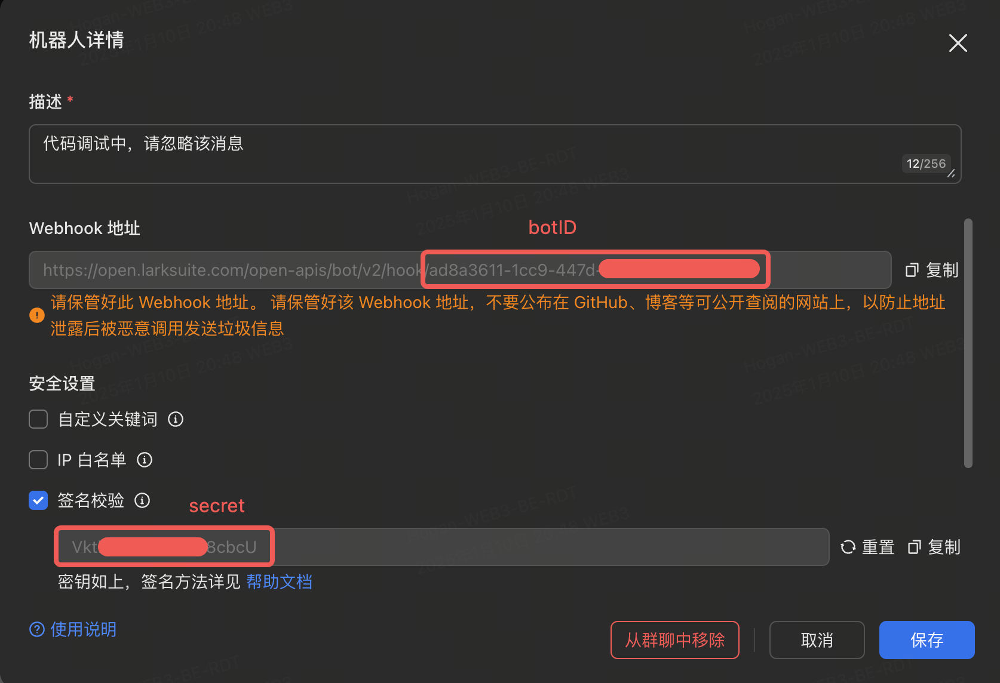
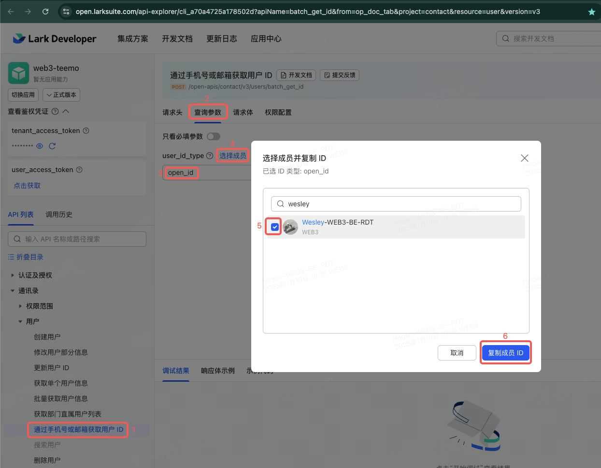
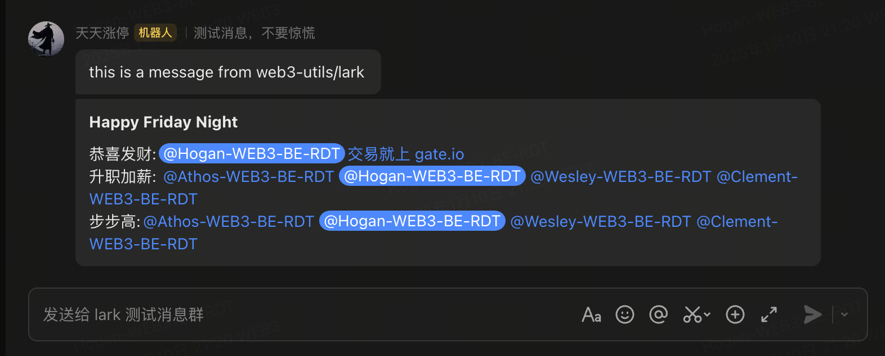

# web3-utils
# 各个 package 用法介绍

## sync/errgroup
常用的 errgroup 是 `golang.org/x/sync/errgroup`，用法如下：  
```go
import (
	"golang.org/x/sync/errgroup"
)

func main() {
    var g errgroup.Group
    g.Go(func() error {
        //...
    })
    g.Go(func() error {
        //...
    })
    err := g.Wait()
    if err != nil {
       log.Error("got err"， err.Error())
    }
}
```

但是这里 `err := g.Wait()` 得到的是所有 goroutine 中第一个返回的 error。

本仓库中的 `sync/errgroup` 实现了与 `golang.org/x/sync/errgroup` 相同的 ` Go(f func() error)` 和 `Wait()` 方法，且 `err := g.Wait()` 得到的 `err` 包含了所有 goroutine 返回的 error。通过 `err.Error()` 得到的 string， 包含了所有 goroutine 返回的 error 的 `Error()` 信息，以 `\n` 分隔。

用法参考 `sync/errgroup/errgroup_test.go`。


## lark

### 自定义机器人  
参考 lark openapi 官方文档： [在群组中添加自定义机器人](https://open.larksuite.com/document/client-docs/bot-v3/use-custom-bots-in-a-group)

botID， secret 均可在机器人详情页面获得。




### 获取用户 user_open_id:
参考 lark openapi 官方文档：  https://open.larksuite.com/document/faq/trouble-shooting/how-to-obtain-openid

#### 快捷方式  
https://open.larksuite.com/api-explorer/cli_a70a4725a178502d?apiName=batch_get_id&from=op_doc_tab&project=contact&resource=user&version=v3

进入如上页面，

按下图进行操作即可：  


### 使用 SDK 发送普通文本消息

`go.mod`:
```go
module web3-xyz

go 1.22.2

require (
	web3-utils v0.0.1
)


replace web3-utils => github.com/gagatechainte/web3-utils v0.0.1
```

`main.go`:

```go
import (
	"web3-utils/lark"
	"web3-utils/sync/errgroup"
)
func main() {
    var g errgroup.Group
    g.Go(func() error {
        //...
    })
    g.Go(func() error {
        //...
    })
    err := g.Wait()
    if err != nil {
        // 发送 plain text
        lark.SendHookText(AlarmBotID， AlarmSecret， fmt.Sprintf("main task err: %s"， err.Error()))
    }
}
```

### 使用 SDK 发送富文本消息
`main.go`:
```go
import (
	"web3-utils/lark"
	"web3-utils/sync/errgroup"
)
func main() {
    var g errgroup.Group
    g.Go(func() error {
        //...
    })
    g.Go(func() error {
        //...
    })
    err := g.Wait()
    if err != nil {
        // 如果需要 @ 某人，使用如下方式发送富文本信息
        lark.SendHookRichTextMsg(AlarmBotID, AlarmSecret, "报警信息",
            lark.RichTextLine{
                lark.RichTextItemAt(user_open_id), // @somebody
                lark.RichTextItemText(fmt.Sprintf("main task err: %s", err.Error()))，// 文本信息
                lark.RichTextItemHref("交易就上 gate.io", "https://www.gate.io")，// 超链接
            },
        )
    }
}
```

### 消息样式实例  
参考 `lark/send_hook_request_helper_test.go`  
```go
func TestSendHookText(t *testing.T) {
	err := SendHookText(botID, "", "this is a message from web3-utils/lark")
	assert.Error(t, err)

	err = SendHookText(botID, secret, "this is a message from web3-utils/lark")
	assert.NoError(t, err)
}

func TestSendHookRichTextMsg(t *testing.T) {
	SendHookRichTextMsg(botID, secret, "Happy Friday Night",
		RichTextLine{
			RichTextItemText("恭喜发财:"),
			RichTextItemAt(hogan),
			RichTextItemHref("交易就上 gate.io", "https://www.gate.io"),
		},
		RichTextLine{
			RichTextItemText("升职加薪:"),
			RichTextItemAt(athos),
			RichTextItemAt(hogan),
			RichTextItemAt(wesley),
			RichTextItemAt(clement),
		},
		RichTextLine{
			RichTextItemText("步步高:"),
			RichTextItemAt(athos),
			RichTextItemAt(hogan),
			RichTextItemAt(wesley),
			RichTextItemAt(clement),
		},
	)
}
```

在群中接收到的消息:  

---
## 后续  
本仓库后续提供的工具包，均提供 `*_test.go` 文件，用户可以参考其中的用法来调用各个工具方法。   

---
2025.01.10 Fri
---
